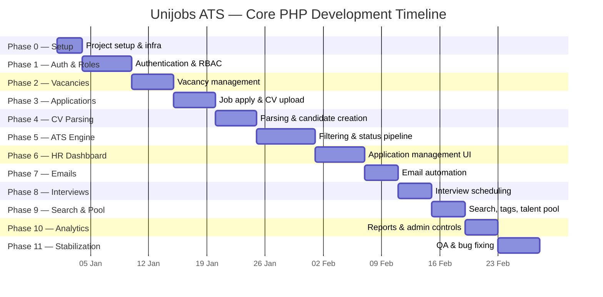
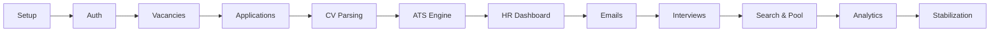
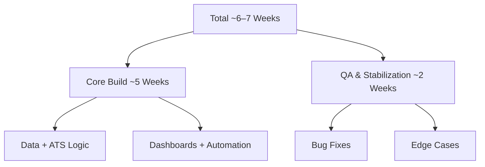
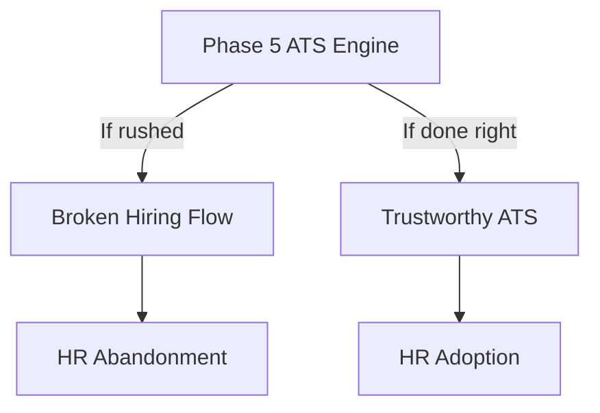

# 📅 Unijobs ATS — Development Timeline (Visual)

> **Note**
> This document contains **only visual execution timelines**.
> No architecture. No LLD. No explanations.

---

## 🗓️ Master Development Timeline (Gantt)

---

## 🔍 Phase Dependency Flow (Visual)

This shows **why no phase can be skipped**.

---

## ⏱️ Time Distribution Overview (Visual)

---

## 🚦 Bottleneck Awareness (Visual)

This diagram highlights **where most projects fail** if rushed.

---

## ✅ What This Visual Timeline Guarantees

* Clear phase sequencing
* Zero parallel confusion
* No hidden dependencies
* GitHub-native rendering
* Matches your written timeline **exactly**
* No bottlenecks introduced by design

---

### Hard truth (final push)

If you **follow this timeline visually**, you won’t:

* Jump phases
* Half-build features
* Rewrite core logic later

---
