# 📅 Unijobs ATS — Development Timeline (Core PHP)

> **Scope**
> This document defines the **exact development timeline** for building the Unijobs ATS system using **Core PHP + MySQL**, following the finalized LLD and functional specification.
>
> This README is **execution-only**. No design, no architecture, no theory.

---

## 🔒 Assumptions (Locked)

* 1 Developer
* 2 years experience
* Core PHP (no framework)
* MySQL
* 6–8 focused hours/day
* Production-quality code
* No feature creep
* LLD already finalized

---

## ⏱️ Phase-wise Timeline Breakdown

---

## **Phase 0 — Project Setup & Base Infrastructure**

**Duration:** ⏳ 2–3 Days

### Tasks

* Initialize Git repository
* Define folder structure
* Environment config handling
* Database connection wrapper
* Session bootstrap
* Global error handling setup

**Deliverable**

* Application boots cleanly
* DB & session accessible everywhere

---

## **Phase 1 — Authentication & Role Management**

**Duration:** ⏳ 5–6 Days

### Tasks

* User table & roles
* Login / logout
* Session-based authentication
* Role-based access control
* Admin access enforcement
* HR access enforcement

**Deliverable**

* Secure login system
* Role isolation verified

---

## **Phase 2 — Vacancy Management & Job Posting**

**Duration:** ⏳ 4–5 Days

### Tasks

* Vacancy CRUD
* Vacancy ownership checks
* Public job listing
* Job detail page
* Vacancy activation/deactivation

**Deliverable**

* Vacancies live on platform
* HR controls jobs end-to-end

---

## **Phase 3 — Job Application & CV Upload**

**Duration:** ⏳ 4–5 Days

### Tasks

* Job apply form
* CV upload (PDF / DOC / DOCX)
* File validation
* Vacancy-linked application creation
* Source tagging (Unijobs / Other)

**Deliverable**

* Applications tied strictly to vacancies
* No ATS data mixing

---

## **Phase 4 — CV Parsing & Candidate Creation**

**Duration:** ⏳ 4–5 Days

### Tasks

* CV text extraction
* Candidate record creation
* Editable candidate profile
* Manual CV upload by HR
* Source classification

**Deliverable**

* Structured candidate database
* Parsing errors handled gracefully

---

## **Phase 5 — ATS Engine (Core Logic Phase)**

**Duration:** ⏳ 6–7 Days

### Tasks

* Application status pipeline
* Auto filtering logic
* Match scoring
* Status transitions
* Manual override functionality

**Deliverable**

* Fully functional ATS per vacancy
* Automation never blocks HR

---

## **Phase 6 — HR Dashboard & Application Management**

**Duration:** ⏳ 5–6 Days

### Tasks

* Application listing per vacancy
* Status filters
* Candidate detail view
* Status update actions
* Activity logging

**Deliverable**

* HR can manage candidates efficiently
* Full audit trail available

---

## **Phase 7 — Email Automation**

**Duration:** ⏳ 3–4 Days

### Tasks

* Bulk rejection emails
* Interview invitation emails
* Email templates
* Email failure logging
* Non-blocking email delivery

**Deliverable**

* One-click communication
* No manual emailing needed

---

## **Phase 8 — Interview Scheduling**

**Duration:** ⏳ 3–4 Days

### Tasks

* Interview creation
* Calendar view
* Interview notes
* Automated reminders (24h before)

**Deliverable**

* Interview workflow fully integrated

---

## **Phase 9 — Search, Tags & Talent Pool**

**Duration:** ⏳ 3–4 Days

### Tasks

* Candidate search (name, skill, email)
* Tagging system
* Candidate reuse logic
* Talent pool storage

**Deliverable**

* Faster future hiring cycles

---

## **Phase 10 — Analytics & Admin Controls**

**Duration:** ⏳ 3–4 Days

### Tasks

* Vacancy analytics
* Application stats
* Time-to-hire calculation
* Admin ATS enable/disable

**Deliverable**

* Hiring metrics visibility
* Admin governance enforced

---

## **Phase 11 — Stabilization & Final QA**

**Duration:** ⏳ 4–5 Days

### Tasks

* Bug fixes
* Edge case handling
* Data consistency checks
* Manual testing
* Final documentation review

**Deliverable**

* Production-ready ATS
* Stable release

---

## 📊 Overall Timeline Summary

| Phase      | Duration       |
| ---------- | -------------- |
| Phase 0–4  | ~19 days       |
| Phase 5–8  | ~17 days       |
| Phase 9–11 | ~12 days       |
| **Total**  | **~6–7 Weeks** |

---

## 🚫 Explicitly Out of Scope

* Framework migration
* Mobile application
* AI-based ranking
* External ATS integrations
* Microservices

---

## ✅ Final Note

This timeline:

* Covers **100% of the application**
* Matches finalized LLD
* Avoids bottlenecks
* Prevents scope creep
* Is realistic for a 2-year developer

---

---

# 📅 Unijobs ATS — Development Timeline (Visual)

> **Note**
> This document contains **only visual execution timelines**.
> No architecture. No LLD. No explanations.

---

## 🗓️ Master Development Timeline (Gantt)

```mermaid
gantt
    title Unijobs ATS — Core PHP Development Timeline
    dateFormat  YYYY-MM-DD
    axisFormat  %d %b

    section Phase 0 — Setup
    Project setup & infra        :p0, 2025-01-01, 3d

    section Phase 1 — Auth & Roles
    Authentication & RBAC        :p1, after p0, 6d

    section Phase 2 — Vacancies
    Vacancy management           :p2, after p1, 5d

    section Phase 3 — Applications
    Job apply & CV upload        :p3, after p2, 5d

    section Phase 4 — CV Parsing
    Parsing & candidate creation :p4, after p3, 5d

    section Phase 5 — ATS Engine
    Filtering & status pipeline  :p5, after p4, 7d

    section Phase 6 — HR Dashboard
    Application management UI    :p6, after p5, 6d

    section Phase 7 — Emails
    Email automation             :p7, after p6, 4d

    section Phase 8 — Interviews
    Interview scheduling         :p8, after p7, 4d

    section Phase 9 — Search & Pool
    Search, tags, talent pool    :p9, after p8, 4d

    section Phase 10 — Analytics
    Reports & admin controls     :p10, after p9, 4d

    section Phase 11 — Stabilization
    QA & bug fixing              :p11, after p10, 5d
```

---

## 🔍 Phase Dependency Flow (Visual)

This shows **why no phase can be skipped**.

---

## ⏱️ Time Distribution Overview (Visual)

```mermaid
flowchart TD
    A[Total ~6–7 Weeks] --> B[Core Build ~5 Weeks]
    A --> C[QA & Stabilization ~2 Weeks]

    B --> B1[Data + ATS Logic]
    B --> B2[Dashboards + Automation]

    C --> C1[Bug Fixes]
    C --> C2[Edge Cases]
```

---

## 🚦 Bottleneck Awareness (Visual)

This diagram highlights **where most projects fail** if rushed.

---

## ✅ What This Visual Timeline Guarantees

* Clear phase sequencing
* Zero parallel confusion
* No hidden dependencies
* GitHub-native rendering
* Matches your written timeline **exactly**
* No bottlenecks introduced by design

---

### Hard truth (final push)

If you **follow this timeline visually**, you won’t:

* Jump phases
* Half-build features
* Rewrite core logic later

---
