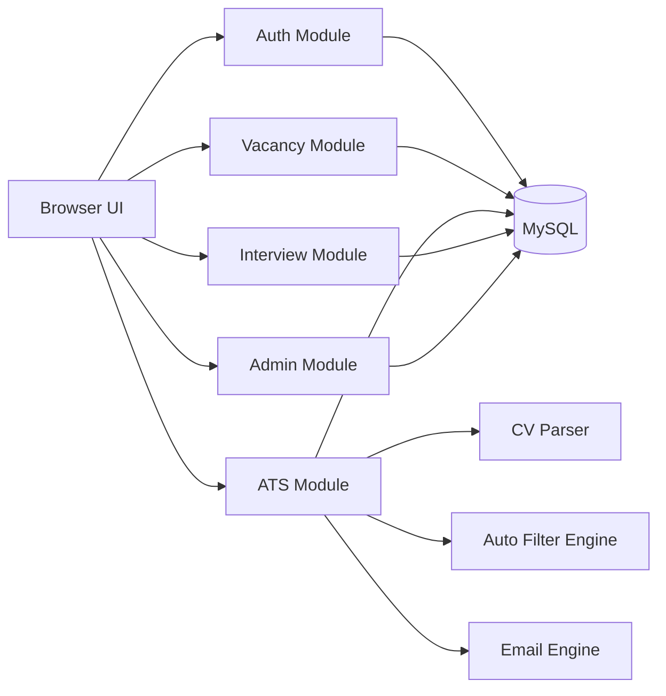
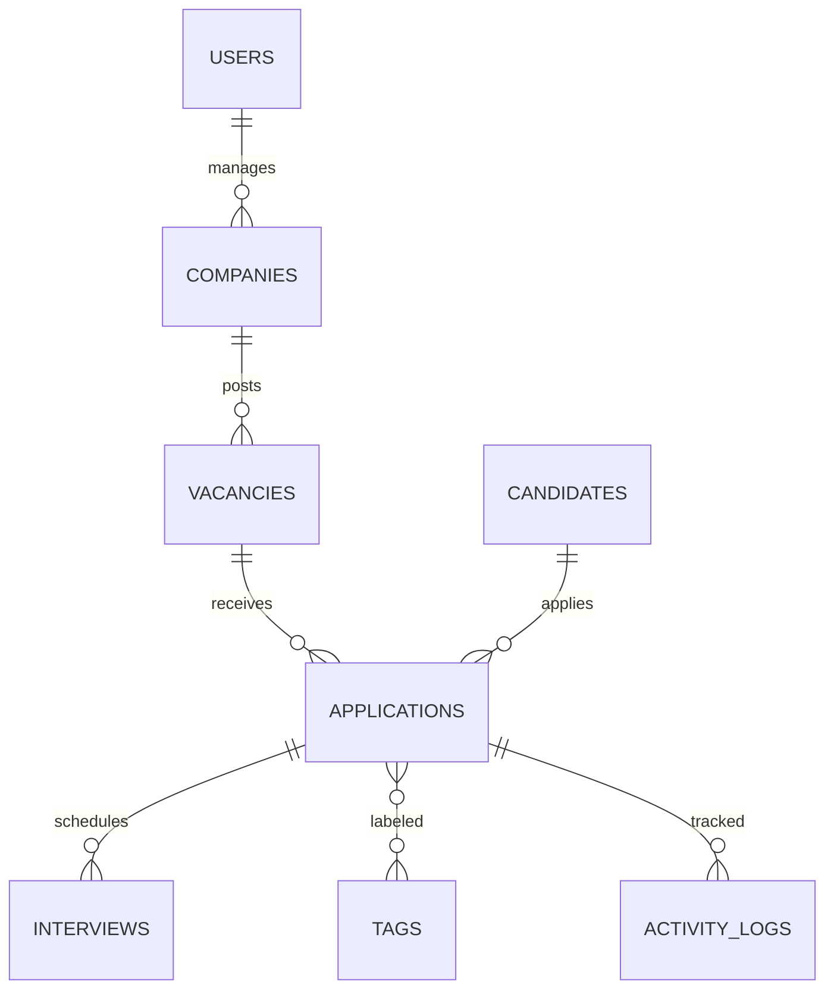
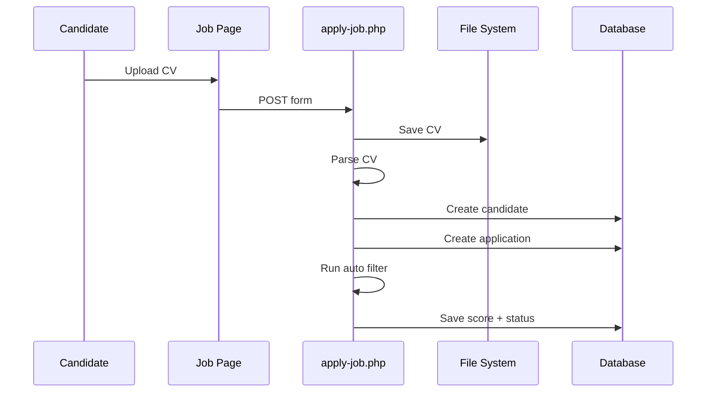
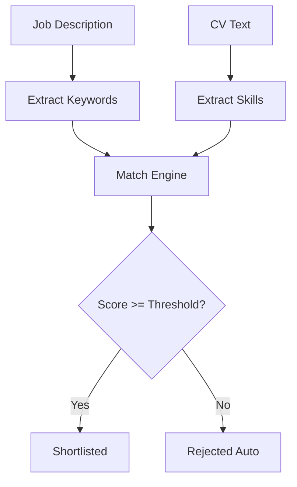
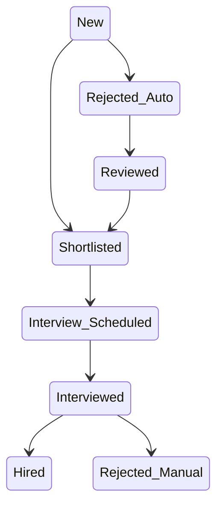
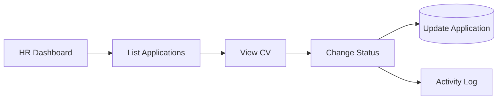
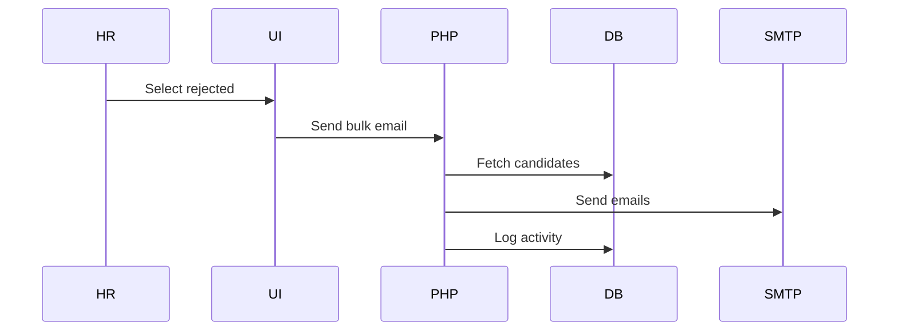
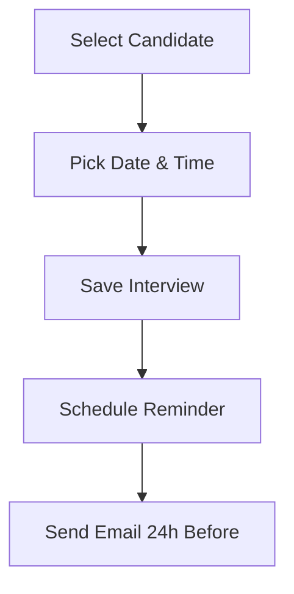
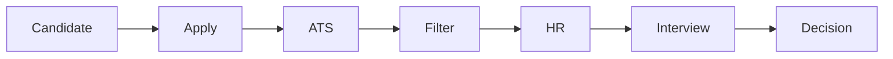

# 📘 Unijobs ATS — Low Level Design (LLD)

> **Technology**
> Backend: Core PHP (procedural + service files)
> Database: MySQL
> Auth: PHP Sessions
> Mail: SMTP
> Storage: Local filesystem

This document explains **how the application actually works internally**, at **file, table, API, and flow level**, with **visual diagrams** rendered directly in GitHub.

---

## 1️⃣ SYSTEM MODULE BREAKDOWN (LLD)



### Modules

* **Auth**: login, roles, sessions
* **Vacancy**: job posting, ownership
* **ATS**: applications, status pipeline
* **Parser**: CV text extraction
* **Filter**: JD vs CV matching
* **Email**: rejection + reminders
* **Interview**: calendar & scheduling
* **Admin**: access control

---

## 2️⃣ DATABASE — LOW LEVEL ER DESIGN



### Key Tables (LLD View)

#### `applications` (ATS Core)

| Field        | Purpose                      |
| ------------ | ---------------------------- |
| id           | unique                       |
| vacancy_id   | **isolates ATS per vacancy** |
| candidate_id | applicant                    |
| source       | Unijobs / Other              |
| score        | match %                      |
| status       | pipeline state               |
| created_at   | timeline                     |

⚠️ **Rule enforced**:
No application exists **without a vacancy** 

---

## 3️⃣ CV INGESTION FLOW (DETAILED)



### Important

* Parser failure ❌ does NOT reject application
* HR can always edit parsed data manually

---

## 4️⃣ AUTO FILTER ENGINE (LLD LOGIC)



### Filtering Rules

* Keyword match
* Skill overlap
* Experience count (basic)

📌 **Rejected ≠ Hidden**
Rejected CVs remain visible & reversible 

---

## 5️⃣ ATS STATUS PIPELINE (STATE MACHINE)



### Design Guarantee

* No terminal state blocks HR action
* Manual override always allowed

---

## 6️⃣ HR DASHBOARD → APPLICATION FLOW



---

## 7️⃣ BULK REJECTION EMAIL FLOW



### Guarantees

* Same email template
* Failure logged, not blocking
* One-click operation 

---

## 8️⃣ INTERVIEW SCHEDULING (LLD)



---

## 9️⃣ INTERNAL PHP FILE STRUCTURE (REALISTIC)

```
/public
  login.php
  apply-job.php
  dashboard.php

/app
  /auth
    login.service.php
    auth.middleware.php

  /vacancy
    vacancy.service.php

  /ats
    application.service.php
    filter.engine.php
    status.manager.php

  /cv
    parser.service.php

  /email
    mailer.service.php

  /interview
    interview.service.php

  /admin
    access.service.php

/core
  db.php
  session.php
  config.php
```

No frameworks.
Each file has **one responsibility**.

---

## 🔟 COMPLETE USER JOURNEY (END-TO-END)



---

## 1️⃣1️⃣ NON-FUNCTIONAL GUARANTEES

* Vacancy-isolated ATS pipelines 
* Manual override everywhere
* Simple UX (low-skill HR friendly)
* No hidden automation
* Fully auditable via logs

---

## 1️⃣2️⃣ WHAT THIS DESIGN AVOIDS (INTENTIONALLY)

❌ Microservices
❌ Message queues
❌ JWT
❌ AI hype
❌ Over-engineering

This is **production-correct**, not “LinkedIn-architecture”.

---

## ✅ FINAL STATEMENT

This README:

* Covers **entire application**
* Is **pure LLD**
* Is **GitHub-renderable**
* Is **implementation-ready**
* Matches **every ATS rule in spec** 

---

